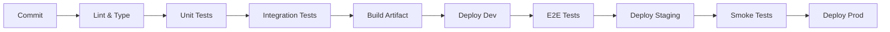

# CI / CD

Pipeline stages, artifact management, environment promotion, and deployment conventions.

---

## 1. Principles

- **Fail fast** — lint and type-check before tests; no point testing untyped code
- **Immutable artifacts** — build once, promote the same artifact through environments
- **Idempotent deploy** — same commit deployed to any environment produces the same result
- **No manual gate** — CI/CD is fully automated; manual intervention only for rollback

---

## 2. Pipeline Stages



### Stage Details

| Stage | Tools | Fail action |
|-------|-------|-------------|
| Lint & Type | ESLint, Prettier, TypeScript, ruff, etc. | Block pipeline |
| Unit Tests | Jest, pytest, JUnit, etc. | Block pipeline |
| Integration Tests | Supertest, Testcontainers | Block pipeline |
| Security Scan | npm audit, Semgrep, truffleHog | Block pipeline |
| Build | Webpack, esbuild, Docker | Block pipeline |
| Deploy Dev | Automated | Auto-deploy |
| E2E Tests | Playwright, Cypress | Block staging promotion |
| Deploy Staging | Automated | Auto-deploy |
| Smoke Tests | Health checks, critical path | Block prod promotion |
| Deploy Prod | Automated (or one-click) | N/A |

---

## 3. Artifact Management

- **Versioning**: semver (`{major}.{minor}.{patch}+{commit_sha}`)
- **Tags**: Git tag on every release: `v{major}.{minor}.{patch}`
- **Storage**: Docker registry (ECR, GHCR) + package registry (npm, PyPI)
- **Retention**: keep last 50 builds; keep all tagged releases

---

## 4. Environment Promotion

| Environment | Deploy trigger | Rollback | Notes |
|-------------|---------------|----------|-------|
| Dev | Every merge to `main` | `git revert` + auto-deploy | Shared dev environment |
| Staging | Manual via GitHub Action workflow_dispatch | `git revert` + deploy previous artifact | Mirrors prod configuration |
| Prod | Manual via GitHub Action with approval | Deploy previous artifact | Canary or blue-green |

---

## 5. Feature Flags

- Every new feature behind a flag until tested in staging
- Flags are additive — remove the flag, not the feature
- Flag name convention: `feature.{snake_case_name}`

---

## 6. Rollback Procedure

1. Identify the bad deployment (monitoring alert, user report)
2. Trigger rollback via CI/CD pipeline (redeploy previous artifact)
3. Verify rollback (health checks pass, error rate normalizes)
4. Postmortem: root cause, fix, prevent recurrence

---

## 7. Testing & Validation

| Layer | Scope | Tool | Command | Failure |
|-------|-------|------|---------|---------|
| Pipeline | Every stage passes | CI/CD config (GitHub Actions, GitLab CI) | `git push` | Any stage fails |
| Artifact | Build produces deterministic output | Docker build / package build | `npm run build` | Hash mismatch |
| Smoke | Deployed instance responds to health check | curl / custom health endpoint | `curl -f /health` | HTTP non-200 |
| Rollback | Rollback restores previous version | Manual test | Trigger rollback | Deployment not on previous version |

### Self-Validation

```bash
# Run locally the same checks CI would run
npm run lint && npm run typecheck && npm test && npm run build
```
